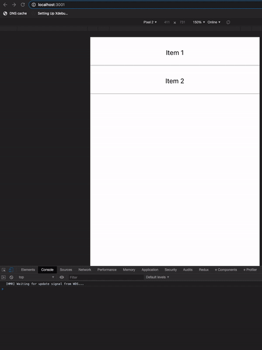

# React-Beautiful-Dnd Potential Chromium Bug Example

This repo demonstrates a potential bug in Blink/Chromium (seen on both desktop Chrome and mobile Brave browser).

This bug appears when dragging items in either desktop chrome in the device toolbar,
or on mobile devices running a Chromium browser. I was able to reproduce on a Pixel XL using Chrome or Brave,
as well as my Macbook Pro w/ Chrome in Device Toolbar (regardless of device). I was not able to reproduce
in either Firefox or Safari, as well as MacOS's Simulator running Safari.

